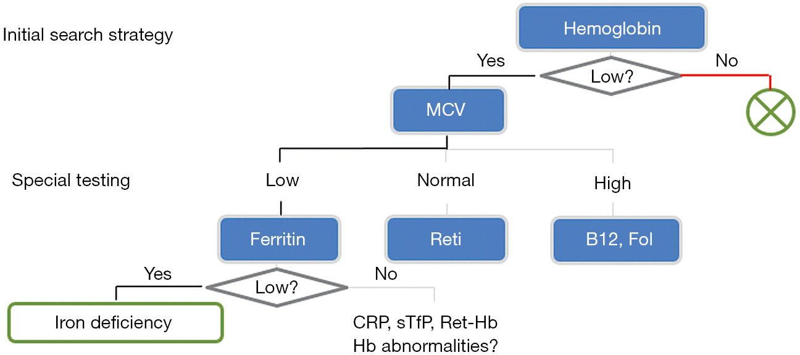

```{r}
library(tidyverse)
library(googlesheets4)
library(class)
library(caret)
```

------------------------------------------------------------------------

Choose a suitable dataset from [this](https://github.com/HAN-M3DM-Data-Mining/assignments/tree/master/datasets) folder and train your own kNN model. Follow all the steps from the CRISP-DM model.

## Set-up

Before we can start with this assignment the installation and activation of some packages is needed:

```{r}
library(tidyverse)
library(dplyr)
library(janitor)
```

## Business Understanding

This assignment is based on the data and story of Georg Hoffmann, Andreas Bietenbeck, Ralf Lichtinghagen and Frank Klawonn [@hoffmann2018].

When laboratory have to make a diagnose, their way of making decisions is based on rules: "If...then...else". This way of diagnosing can be seen as a decision tree. Those treebranches can be seen as established medical guidelines that lead at some point to a diagnosis, like shown in the example down below.

{#hemoglobin}

This data problem is about creating a KNN model that can determine in what stage a patient is:

-   C0 = healthy person
-   C1 = hepatitis without fibrosis or with only minor signs of portal fibrosis
-   C2 = therapy-relevant fibrosis
-   C3 = LTX-relevant end stage liver cirrhosis

The data for this study is based on 73 patients (53 males, 22 females), aged 19 to 75 years (median 50), with a proven serological and histopathological diagnosis of hepatitis C. Who have suffer a chronic hepatitis C infection without fibrosis to end stage liver cirrhosis with a need for liver transplantation (LTX).

## Data Understanding

As said, this data comes from an open source data set from Georg Hoffmann, Andreas Bietenbeck, Ralf Lichtinghagen and Frank Klawonn [@hoffmann2018].

At first, we copy the original dataset to a new dataframe so if a error is made, the original data won't be messed up.

```{r}
rawDf<-KNN_hcvdat0
```

### Prperties of the data

```{r}
str(rawDf)
```

As we can see does the dataframe consist of 12 columns that consist of a numeric kind of data and two columns have characteristic data. In total the data set contains 615 observations.

```{r}
rawDf %>% 
  tabyl(Category, Sex)
```

## Data Preparation

text and code here

## Modeling

text and code here

## Evaluation and Deployment

text and code here

reviewer adds suggestions for improving the model

## Bibliography
